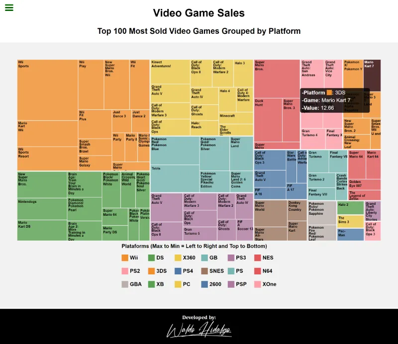
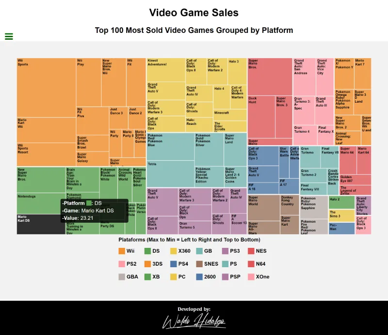

# Treemap: Video Game Sales Data Top 100

Repositorio con el código del [proyecto quinto y último proyecto](https://www.freecodecamp.org/learn/data-visualization/data-visualization-projects/visualize-data-with-a-treemap-diagram) para obtener la **Data Visualization Certification** de freecodecamp.

La data utilizada se encuentra en el siguiente link: [link a data utilizada](https://cdn.freecodecamp.org/testable-projects-fcc/data/tree_map/video-game-sales-data.json)

## Tabla de Contenido

- [Treemap: Video Game Sales Data Top 100](#treemap-video-game-sales-data-top-100)
  - [Tabla de Contenido](#tabla-de-contenido)
  - [Requisitos](#requisitos)
  - [All tests passed](#all-tests-passed)
  - [Screenshots](#screenshots)
    - [1. Home](#1-home)
    - [2. Remarcado de rectángulos de categoría al hacer click en cuadrado de legenda respectivo](#2-remarcado-de-rectángulos-de-categoría-al-hacer-click-en-cuadrado-de-legenda-respectivo)
    - [3. Tooltips](#3-tooltips)
      - [3.1. Tooltip Upper Left](#31-tooltip-upper-left)
      - [3.2. Tooltip Upper Right](#32-tooltip-upper-right)
      - [3.3. Tooltip Bottom Left](#33-tooltip-bottom-left)
      - [3.4. Tooltip Bottom Right](#34-tooltip-bottom-right)

## Requisitos

## All tests passed

## Screenshots

### 1. Home

### 2. Remarcado de rectángulos de categoría al hacer click en cuadrado de legenda respectivo

### 3. Tooltips

Todos los tooltips se muestran dentro del gráfico:

#### 3.1. Tooltip Upper Left

#### 3.2. Tooltip Upper Right

#### 3.3. Tooltip Bottom Left

#### 3.4. Tooltip Bottom Right

